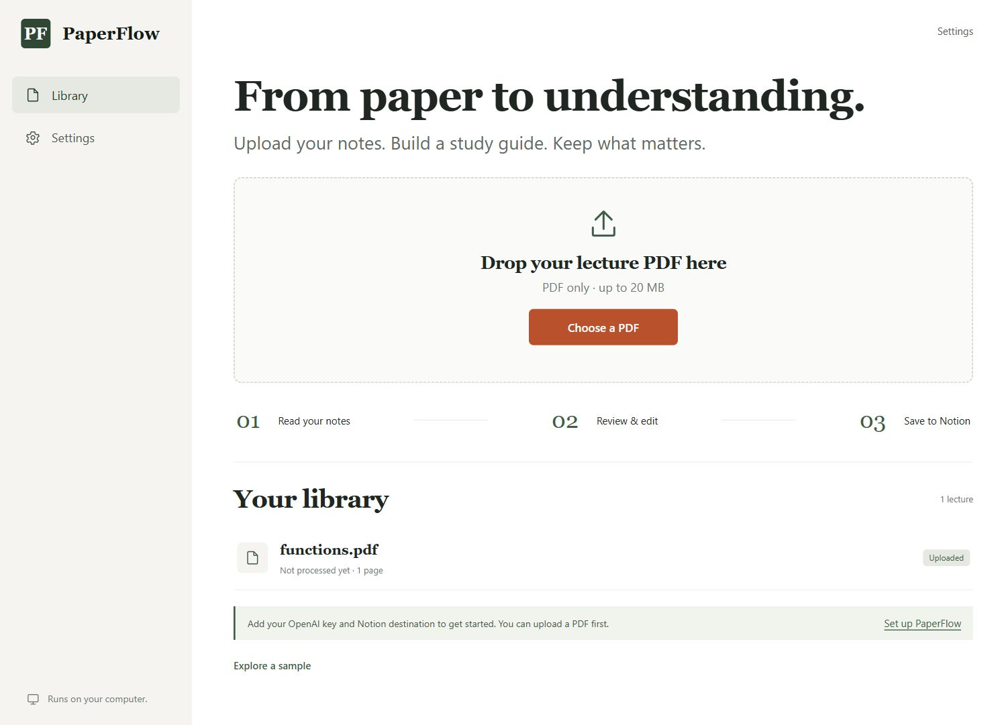

# PaperFlow

Turn handwritten lecture PDFs into editable study guides, organized Notion pages, and Anki flashcards.

PaperFlow runs on your computer. Export a notebook from reMarkable, upload the PDF, review the generated material, and publish when you're ready. Each user supplies their own OpenAI and Notion credentials through the browser setup screen.



## Get started

1. Install **[Node.js 24 LTS or newer](https://nodejs.org/)**. Close and reopen your terminal after installation.
2. Download this repository using **Code → Download ZIP** and extract it, or clone it:

   ```sh
   git clone https://github.com/ishaanp987/PaperFlow.git
   cd PaperFlow
   ```

3. In the extracted project folder, run:

   ```sh
   node src/server.ts
   ```

4. Open **[http://127.0.0.1:3000](http://127.0.0.1:3000)** and choose **Settings**.

There is no dependency installation or build step required to run the app. Windows PowerShell, macOS Terminal, and Linux terminals use the same startup command. To stop PaperFlow, press Ctrl+C in that terminal.

You can choose **Explore a sample** before adding keys. Sample content is prewritten, clearly labeled, and cannot be published to Notion. It lets you try editing, saving, and CSV export without making API calls. The included `examples/functions.pdf` is a typed test document, not a handwriting accuracy benchmark.

## Connect your accounts

### OpenAI

Create an API key in the [OpenAI API dashboard](https://platform.openai.com/api-keys), configure API billing, and paste the key into Settings. ChatGPT subscriptions and API usage have [separate billing](https://help.openai.com/en/articles/9039756-managing-billing-settings-on-the-chatgpt-web-and-api-platform).

The default model is `gpt-4.1-mini`, which supports vision and structured output. You can enter another model that supports PDF input and strict JSON schema output. **Save & test OpenAI** verifies the key's access to the selected model without generating notes; it does not measure handwriting accuracy or confirm sufficient billing credit.

Processing sends the complete PDF to OpenAI for transcription, then sends the transcription in a second request to generate the guide. Long PDFs and higher-cost models use more API tokens. The app shows token usage but does not estimate dollar costs. Retries of a failed generation reuse the saved transcription where possible.

### Notion

1. Create a normal Notion page called **PaperFlow** to serve as your destination. Use a page, rather than a database, for this version.
2. Create a Notion personal access token or an internal connection following the [official quickstart](https://developers.notion.com/guides/get-started/quick-start) and [internal connection guide](https://developers.notion.com/guides/get-started/create-a-notion-integration).
3. For an internal connection, enable **read, insert, and update content**. Open your destination page's menu, choose **Connections**, and add the connection so it can access that page and its descendants.
4. Paste the token and the destination page URL into Settings. PaperFlow extracts the page ID automatically. You can also paste the ID directly.
5. Choose **Save & test Notion**. This verifies that the destination is readable; writing and file uploads are verified when you publish.

PaperFlow creates or reuses a course page under your destination and publishes a dated lecture page underneath it. The page includes the study guide, flashcard toggles, and the original PDF. File uploads use Notion's [official direct upload API](https://developers.notion.com/guides/data-apis/uploading-small-files); your workspace's file size or storage limits may still reject a PDF.

PaperFlow uses the Notion API version `2026-03-11`.

## Use your notes

1. Export your reMarkable notes as a PDF using the [official export workflow](https://support.remarkable.com/articles/Knowledge/importing-and-exporting-files).
2. Upload one lecture at a time: at most **20 MB and 30 pages**. Password-protected PDFs are not supported.
3. Choose **Generate study guide**. The upload is saved locally before any API call occurs.
4. Review the transcription, summary, concepts, definitions, formulas, review points, and flashcards. Check mathematical symbols and any uncertain handwriting against **Original PDF**.
5. Edit fields or add/remove items and choose **Save edits**. Changes are preserved when you refresh or restart.
6. Choose **Publish to Notion** to save your current edits and send the guide and original PDF to Notion.
7. Choose **Download Anki CSV** to export the edited flashcards.

AI can misread handwriting and generate incorrect material. Uncertain text is flagged when identified, but a lack of flags is not a guarantee of accuracy. Verify the material before relying on it.

Publishing freezes that version of the guide. A partial publish can be retried against the same Notion page. Source markers help recover page creation or PDF attachment if a response is lost. Keep those markers until the publish completes. Publishing edits to an already-published guide is a future feature.

### Import flashcards into Anki

Open Anki Desktop, choose **File → Import**, and select the downloaded CSV. Use the **Basic** note type, map the first column to **Front** and the second to **Back**, choose a deck, and import. The file includes Anki metadata headers so column names are not imported as a flashcard. HTML interpretation is disabled. See the [Anki text import manual](https://docs.ankiweb.net/importing/text-files.html).

CSV import requires no Anki API key or add-on.

## Where your data lives

By default, settings, the SQLite database, and original PDFs are stored outside the repository in **`~/.paperflow`**:

| Platform | Default folder |
| --- | --- |
| Windows | `%USERPROFILE%\.paperflow` |
| macOS / Linux | `$HOME/.paperflow` |

Keys are saved in `settings.json` on that computer as plaintext. Directories and files are created with restrictive POSIX permissions; Windows uses the containing user folder's access controls. The API only returns whether a key is configured, never the saved secret. Keys are not stored in browser storage, included in PDFs or exports, or sent to GitHub. Only the relevant credential is sent to its provider.

PaperFlow binds to `127.0.0.1`, validates request origins and hostnames, and has no user authentication. It is intended for a trusted personal computer. Do not expose it through a public proxy or use it as a shared hosted service.

There is no telemetry. Notes leave the computer when you explicitly process them with OpenAI or publish them to Notion. Responses use `store: false`; this is not a guarantee of zero provider retention. Provider data policies still apply.

Stop the app before backing up or removing the data folder. Removing this folder resets all saved keys and local lectures. It does not delete pages already published in Notion. Removing a key in Settings does not revoke that credential with its provider; revoke it there if needed.

## Optional environment configuration

Browser Settings is the recommended path. Environment variables take precedence over saved settings, and the UI labels those fields as managed by the environment.

Copy `.env.example` to `.env`, fill in the values, and run:

```sh
node --env-file=.env src/server.ts
```

Supported variables: `OPENAI_API_KEY`, `OPENAI_MODEL`, `NOTION_API_KEY`, `NOTION_PARENT_PAGE_ID`, `PAPERFLOW_DATA_DIR`, and `PORT`. To choose a different port without a file:

```powershell
# Windows PowerShell
$env:PORT = "3001"
node src/server.ts
```

```sh
# macOS / Linux
PORT=3001 node src/server.ts
```

## Development

```sh
node --watch src/server.ts
node --test test/*.test.ts
node scripts/check.mjs
```

If npm is available, `npm start`, `npm run dev`, `npm test`, and `npm run build` run the same commands. The build command checks source syntax and the vendored PDF parser's integrity; the app does not require bundling. Node.js executes the TypeScript server files through its built-in type stripping. The build does not perform static TypeScript type checking.

The implementation uses Node's HTTP server, SQLite, native `fetch`, and a small browser UI. Direct REST clients keep installation free of SDK dependency downloads. See [ARCHITECTURE.md](ARCHITECTURE.md) for interfaces, API routes, status transitions, and extension points. The pinned PDF parser is documented in [THIRD_PARTY_NOTICES.md](THIRD_PARTY_NOTICES.md).

Tests use synthetic files and mocked provider responses. They do not call OpenAI or Notion or require credentials. GitHub Actions runs tests and source checks on Windows, macOS, and Linux.

## Current scope and roadmap

The MVP includes manual PDF ingestion, durable lecture history, browser credential setup, grounded structured generation, editing, Notion publication with original PDF, and Anki CSV export.

Future extensions: watched folders or email ingestion, direct AnkiConnect export, additional AI providers, updating published pages, and packaged desktop installers. Automated reMarkable ingestion is not implemented yet.

## Troubleshooting

| Symptom | What to check |
| --- | --- |
| Node cannot run `.ts` files | Install Node.js 24 or newer. |
| Port is already in use | Stop the other process or set `PORT=3001`. |
| OpenAI key test fails | Confirm the key, selected model, and project access. |
| Processing reaches a usage limit | Check API billing and rate limits, then retry. |
| Notion cannot find the page | Add the connection to the destination page and use the page URL, not a database URL. |
| Notion PDF upload fails | Check workspace file limits; try a smaller PDF, restore the original destination, and retry the partial publish. |
| App stopped during processing | Reopen the lecture and choose Retry processing. |
| App stopped during publishing | Reopen the lecture and choose Retry Notion publish. |

Report reproducible issues without keys or private PDFs. See [CONTRIBUTING.md](CONTRIBUTING.md) and [SECURITY.md](SECURITY.md).

## License

MIT. PaperFlow is an independent project and is not affiliated with reMarkable, OpenAI, Notion, or Anki.
